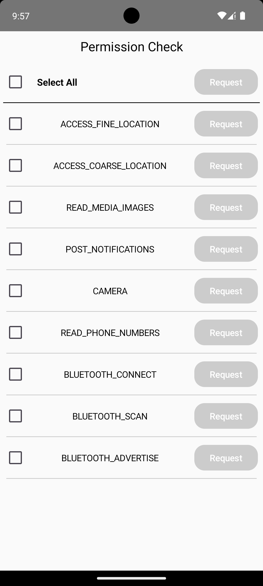
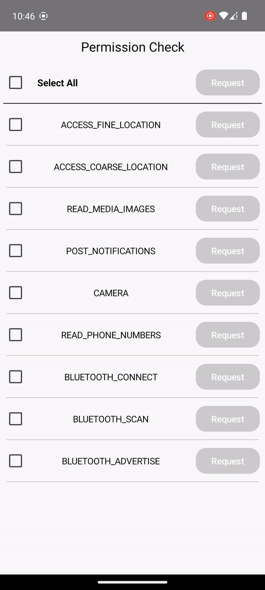
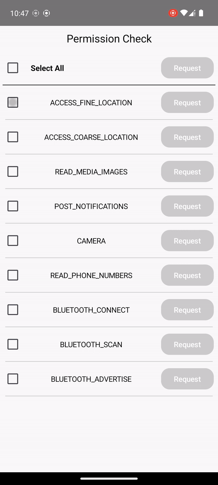
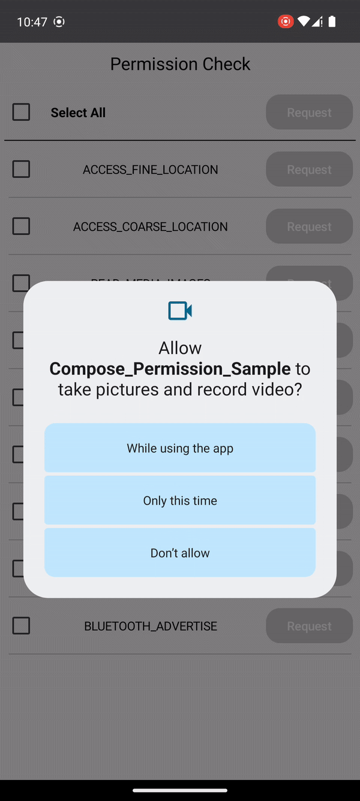

# Permission Check with Compose

## 개요

Jetpack Compose 기반의 [권한 체크] 및 [권한 요청] 구현 샘플 프로젝트
프로젝트의 형식으로 만들기 위해 다소 코드가 추가되었지만 실제 사용 시, 보다 간편하게 사용할 수 있다.



## 목표

- Jetpack Compose를 이용한 권한 체크 및 권한 요청 구현
- LazyColumn을 이용한 권한 목록 구현

## 빌드 환경

### Android Studio

- Android Studio Hedgehog | 2023.1.1 Patch 1
- Build #AI-231.9392.1.2311.11255304, built on December 27, 2023

### Android SDK

- Android SDK Build-Tools 35-rc2
- Android SDK Platform-Tools 34.0.5

### Java

- Java 1.8

### Kotlin

- Kotlin Version: 1.9.22

### Compose Compiler

- Kotlin Compose Compiler Version: 1.5.10

### Gradle

- Android Gradle Plugin Version: 8.1.2
- Gradle Version: 8.2

## 구성

프로젝트 소스코드는 main만 사용
구성은 다음과 같다.

```agsl
├── PermissionSample.kt
├── MainActivity.kt
├── data
├── permissions
├── ui
│  ├── components
│  │   └── dialog  
│  ├── screens
│  │   └── mainscreen
│  └── themes
└── utils
```

### 1. data

```agsl
├── data
│  └── PermissionData.kt
```

Data에는 Permission을 요청하고 허용 여부를 저장하는 프로퍼티로 구성된 `PermissionData` 클래스 존재

### 2. permissions

```agsl
├── permissions
│  ├── PermissionCheck.kt
│  ├── permissionCheckList.kt
│  └── PermissionTextProvier.kt
```

Permission 패키지 내에는, Permission을 체크하고 요청하는 `PermissionCheck` 클래스와 Permission 목록을 가지고 있는 `permissionCheckList` Composable 메서드, 그리고 PermissionDialog에 텍스트를 제공하는 `PermissionTextProvier` 클래스 존재
요청이 필요한 Permission은 `permissionCheckList`에 추가하여 사용
실제 사용 시, 단일 퍼미션의 경우, 개별로 권할 요청 가능
해당 구성은 프로젝트를 샘플코드 형식으로 만들기 위함

### 3. ui

```agsl
├── ui
│  ├── components
│  │   └── dialog  
│  │       └── PermissionDialog.kt  
│  ├── screens
│  │   └── mainscreen
│  │       ├── MainState.kt
│  │       ├── MainEvent.kt
│  │       ├── MainScreen.kt
│  │       └── MainViewModel.kt
│  └── themes
```

ui는 화면을 구성하는 컴포넌트를 파일 수준 함수로 구성 

- `PermissionDialog`는 Permission 요청을 거부한 경우 표시되는 Dialog view를 구성
- mainScreen은 MVI pattern의 presentation layer를 구성
  - `MainState`는 화면의 상태를 저장하는 클래스
  - `MainEvent`는 화면의 이벤트를 저장하는 클래스
  - `MainScreen`은 화면을 구성하는 Composable 메서드
  - `MainViewModel`은 화면의 비즈니스 로직을 처리하는 ViewModel 클래스

### 4. utils

```agsl
├── utils
│  └── PermissionUtils.kt
```

확장함수 및 재사용성이 있는 유틸리티 메서드를 가지고 있다.

# 기능 목록

## 단일 권한 요청

- Reqeust 버튼과 상호작용으로 단일 권한을 요청
- 요청한 권한이 허용되면, CheckBox가 체크 상태로 유지되며 허용된 권한을 표시

  

## 복수 권한 요청
- 요청하고자 하는 권한들을 체크한 후, 상단 우측의 Request 버튼과 상호작용해 권한을 요청
- 요청한 권한들이 허용되면, 각 권한의 CheckBox가 체크 상태로 유지되며 허용된 권한을 표시

  

## 권한 요청 거부 시 Dialog 표시
- 권한 요청 다이얼로그에서 권한을 거부하면, PermissionDialog 표시
- OK 버튼 상호작용 시, 다시 한번 권한 요청 Dialog 표시

  

## 권한 요청 2번 거부 시 AppSetting으로 이동
- 권한 요청 다이얼로그에서 권한을 2번 거부하면, App Setting으로 이동을 유도하는 PermissionDialog 표시
- 'Go to app Setting" 버튼과 상호작용 시, App Setting으로 이동
- 만약 App Setting에서 권한을 허용하지 않고 다시 앱으로 복귀한다면, 지속적으로 App Setting 이동을 유도하는 PermissionDialog 표시

  
